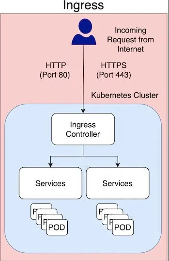

서비스 오브젝트가 외부 요청을 받아들이기 위한 것이였다면 인그레스는 외부 요청을 어떻게 처리할 것인지 네트워크 7계층 레벨에서 정의하는 쿠버네티스 오브젝트이다.

- 외부 요청의 라우팅: `/apple`, `/apple/red` 등과 같이 특정 경로로 들어온 요청을 **어떠한 서비스로 전달할지 정의**하는 라우팅 규칙을 설정할 수 있다.
- 가상 호스트 기반의 요청 처리: 같은 IP에 대해 다른 도메인 이름으로 요청이 도착했을 때, 어떻게 처리할 것인지 정의할 수 있다.
- SSL/TLS 보안 연결 처리: 여러 개의 서비스로 요청을 라우팅할 때, 보안 연결을 위한 인증서를 쉽게 적용할 수 있다.

## 인그레스를 사용하는 이유

인그레스를 사용하지 않고  **SSL/TLS 보안 연결, 접근 도메인 및 클라이언트 상태에 기반한 라우팅 등을 구현하려면 각 서비스와 디플로이먼트에 대해 일일이 설정을 해야 한다.** 하지만 쿠버네티스가 제공하는 인그레스 오브젝트를 사용하면 URL 엔드포인트를 단 하나만 생성함으로써 이러한 번거로움을 쉽게 해결할 수 있다.

라우팅 정의나 보안 연결 등과 같은 세부 설정은 서비스와 디플로이먼트가 아닌 인그레스에 의해 수행된다. 외부 요청에 대한 처리 규칙을 쿠버네티스 자체의 기능으로 편리하게 관리할 수 있다는 것이 인그레스의 핵심이다.

```yaml
# ingress-example.yaml
apiVersion: networking.k8s.io/v1beta1
kind: Ingress
metadata:
  name: ingress-example
  annotations:
    nginx.ingress.kubernetes.io/rewrite-target: /
    kubernetes.io/ingress.class: "nginx"
spec:
  rules:
  - host: alicek106.example.com
    http:
      paths:
      - path: /echo-hostname
        backend:
          serviceName: hostname-service
          servicePort: 80
```

- `host`: 해당 도메인 이름으로 접근하는 요청에 대해 처리 규칙을 적용한다.
- `path`: 해당 경로에 들어온 요청을 어느 서비스로 전달할 것인지 정의한다.
- `serviceName`, `servicePort`: `path`로 들어온 요청이 전달된 서비스와 포트다.

인그레스는 단지 요청을 처리하는 규칙을 정의하는 선언적인 오브젝트일 뿐, 외부 요청을 받아들일 수 있는 실제 서버가 아니다. **인그레스는 인그레스 컨트롤러라고 하는 특수한 서버에 적용해야만 그 규칙을 사용할 수 있다.** 즉, 실제로 외부 요청을 받아들이는 것은 인그레스 컨트롤러 서버이며, 이 서버가 인그레스 규칙을 로드해 사용한다. 따라서 **쿠버네티스의 인그레스는 반드시 인그레스 컨트롤러라는 서버와 함께 사용해야 한다.** 대표적으론 **Nginx 웹 서버 인그레스 컨트롤러**가 있다.

**Nginx 인그레스 컨트롤러를 설치하면 자동으로 생성되는 서비스는 `LoadBalancer` 타입이다.**

```yaml
# ingress-nginx-svc-nodeport.yaml
apiVersion: v1
kind: Service
metadata:
  name: ingress-nginx-controller-nodeport
  namespace: ingress-nginx
spec:
  ports:
  - name: http
    nodePort: 31000
    port: 80
    protocol: TCP
    targetPort: http
  - name: https
    nodePort: 32000
    port: 443
    protocol: TCP
    targetPort: https
  selector:
    app.kubernetes.io/component: controller
    app.kubernetes.io/instance: ingress-nginx
    app.kubernetes.io/name: ingress-nginx
  type: NodePort
```


# **인그레스의 세부 기능: annotation을 이용한 설정**

```yaml
apiVersion: networking.k8s.io/v1beta1
kind: Ingress
metadata:
  name: ingress-example
  annotations:
    nginx.ingress.kubernetes.io/rewrite-target: /
    kubernetes.io/ingress.class: "nginx"
spec:
...
```

- `kubernetes.io/ingress.class`: 해당 인그레스 규칙을 어떤 인그레스 컨트롤러에 적용할 것인지를 의미
- `nginx.ingress.kubernetes.io/rewrite-target`: Nginx 인그레스 컨트롤러에서만 사용할 수 있는 기능이다. 인그레스에 정의된 경로로 들어오는 요청을 `rewrite-target`에 설정된 경로로 전달한다. 예를 들어, Nginx 인그레스 컨트롤러로 `/echo-hostname`으로 접근하면 hostname-service에는 `/` 경로로 전달된다.

`rewrite-target` 은 Nginx의 **캡처 그룹(Captured groups)**과 함께 사용할 때 더 유용한 기능이다.

캡처 그룹이란 정규 표현식의 형태로 요청 경로 등의 값을 변수로서 사용할 수 있는 방법이다.

```yaml
.....
http:
	paths: 
	- path: /echo-hostname(/|$)(.*) #(.*)을 통해 경로를 얻는다.
	  pathType: Prefix
	  backend:
	    service:
	      name: hostname-service
	      port: 
	        number: 80
```

path 항목에서 `(.*)` 은 Nginx 정규 표현식을 통해 `/echo-hostname/` 뒤에 오는 경로를 얻은 뒤, 이 값을 `rewite-target`에서 사용한다. 즉 `/ehco-hostname/` 으로 접근하면 이전과 동일하게 `/`로 전달되지만, `/echo-hostname/color`는 `/color`로, `/echo-hostname/color/red`는 `/color/red`로 전달된다.

# **Nginx 인그레스 컨트롤러에 SSL/TLS 보안 연결 적용**

인그레스에 장점중 하나는 쿠버네티스 뒤쪽에 있는 디플로이먼트나 서비스가 아닌 쿠버네티스 앞쪽에 인그레스 컨트롤러에서 `SSL/TLS` 보안 연결을 설정할 수 있는 것이다.
인그레스 컨트롤러 지점에서 인증서를 적용해 두면 요청이 전달되는 애플리케이션에 대해 모두 인증서 처리를 할 수 있다. 따라서 인그레스 컨트롤러가 보안 연결을 수립하기 위한 일종의 gateway 역할을 한다고 볼 수 있다.

AWS와 같은 클라우드 환경에서 LoadBalancer 타입의 서비스를 사용할 계획이라면 클라우드 플랫폼 자체에서 관리해주는 인증서를 인그레스 컨트롤러에 적용할 수 있다.

```yaml
apiVersion: networking.k8s.io/v1beta1
kind: Ingress
metadata:
  name: ingress-example
  annotations:
    nginx.ingress.kubernetes.io/rewrite-target: /
    kubernetes.io/ingress.class: "nginx"
spec:
  tls: # tls 정의
  - hosts:
    - [사용할 도메인 이름]
    secretName: tls-secret
  rules:
  - host: [사용할 도메인 이름]
    http:
      paths:
      - path: /echo-hostname
        backend:
          service: 
            name: hostname-service
            port:
              number: 80
```

> 하나의 쿠버네티스 클러스터에서 반드시 하나의 인그레스 컨트롤러를 사용해야 하는 것은 아니다. 별도의 값(클래스)을 적용한 Nginx 인그레스 컨트롤러를 생성해 `kubernetes.io/ingress.class`를 해당 값으로 설정할 수도 있다.
>
